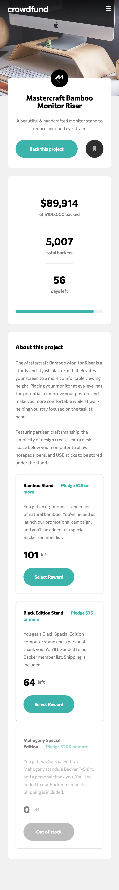
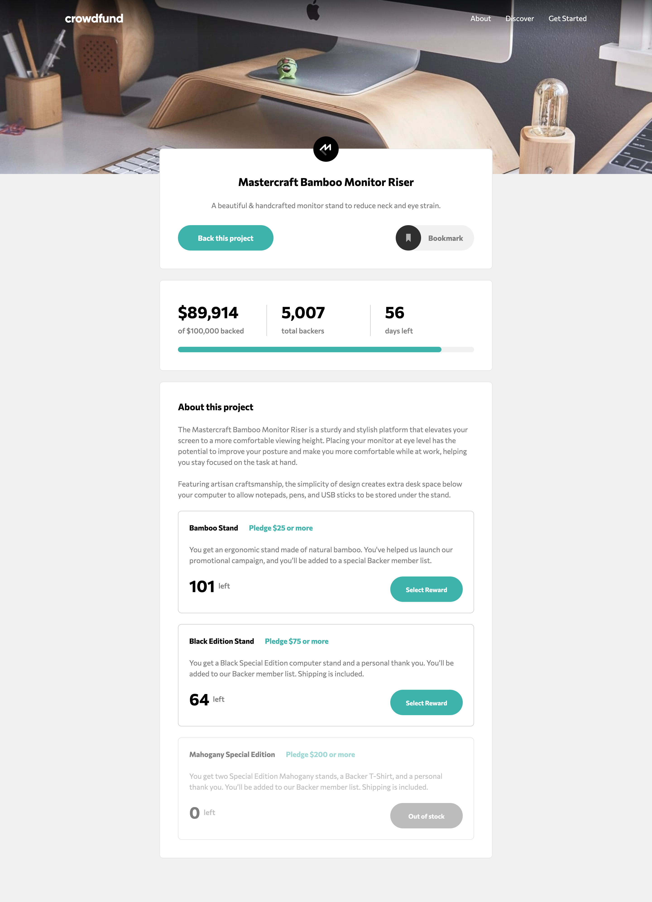

# Frontend Mentor - Crowdfunding product page solution

This is a solution to the [Crowdfunding product page challenge on Frontend Mentor](https://www.frontendmentor.io/challenges/crowdfunding-product-page-7uvcZe7ZR). Frontend Mentor challenges help you improve your coding skills by building realistic projects.

## Table of contents

- [Overview](#overview)
  - [The challenge](#the-challenge)
  - [Screenshot](#screenshot)
  - [Links](#links)
- [My process](#my-process)
  - [Built with](#built-with)
  - [What I learned](#what-i-learned)
- [Author](#author)

## Overview

### The challenge

Users should be able to:

- View the optimal layout depending on their device's screen size
- See hover states for interactive elements
- Make a selection of which pledge to make
- See an updated progress bar and total money raised based on their pledge total after confirming a pledge
- See the number of total backers increment by one after confirming a pledge
- Toggle whether or not the product is bookmarked

### Screenshot

### Links

- Solution URL: [https://www.frontendmentor.io/solutions/crowfunding-product-page-using-typescript-nextjs-tailwindcss-zdH3i076Ld](https://www.frontendmentor.io/solutions/crowfunding-product-page-using-typescript-nextjs-tailwindcss-zdH3i076Ld)
- Live Site URL: [https://fm-crowfunding-product.vercel.app/](https://fm-crowfunding-product.vercel.app/)

## My process

### Built with

- Semantic HTML5 markup
- CSS custom properties
- Flexbox
- CSS Grid
- Mobile-first workflow
- [React](https://reactjs.org/) - JS library
- [Next.js](https://nextjs.org/) - React framework
- TailwindCSS
- TypeScript

### What I learned

- TypeScript, type safety helps me to improve error handling in applications
- TailwindCSS
- Dialog / Modal box, implemented by React Portal. We should instead use the third party library to ensure the correct behaviours of a dialog.

## Author

- Website - [Kenny Ng](https://github.com/kennylun123)
- Frontend Mentor - [@kennylun123](https://www.frontendmentor.io/profile/kennylun123)
- Twitter - [@kenny_ng123](https://www.twitter.com/kenny_ng123)
